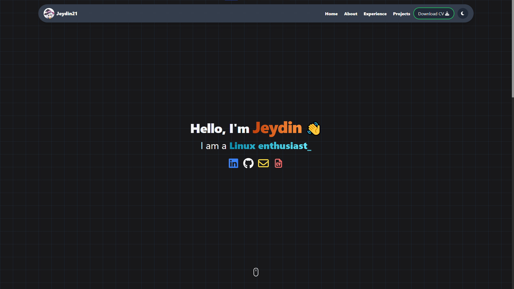

<div align="center">
<h1>Personal Website</h1>
</a>
This is my personal website that is basically horizontal Linktree. You can call it Linkbush if you want.
<br />

### Live demo at [j21.dev](https://j21.dev/)
<br />

 <a href="https://github.com/Jeydin21/Website/blob/main/LICENSE">
    
  </a>
  <a href="https://github.com/Jeydin21/Website/fork">
    
  </a>
  <a href="https://github.com/Jeydin21/Website/stargazers">
    
  </a>

The aim of this project is to practice using Typescript and Tailwind CSS to make a basic landing page layout.
</div>

## Bug Reporting
If you encounter any strange bugs on the website, please let me know by going to [issues](https://github.com/Jeydin21/Website/issues/) and creating a bug report.

## Preview


## Tech Stack
### Front-end:
- [React.js](https://react.dev/)
- [Next.js](https://nextjs.org/)
- [Tailwind CSS](https://tailwindcss.com/)
- [FontAwesome Icons](https://fontawesome.com/icons/)
### Back-end:
- There's no backend 💀

## Local Development
### 1. Clone the project
1. Clone the repository into your system and install the dependencies.
```bash
$ git clone https://github.com/Jeydin21/Website.git
$ cd Website
$ npm install # Or yarn install
```

### 2. Start local development
1. Create a local development server.
```bash
$ npm run dev
```
2. Open the preview [localhost:3000](http://localhost:3000) in your browser.

## License
This project is licensed under the [MIT License](https://opensource.org/license/mit) - see the [License](https://github.com/Jeydin21/Website/blob/main/LICENSE) file for more details